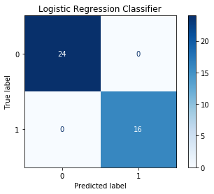
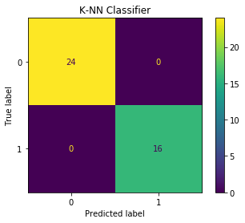
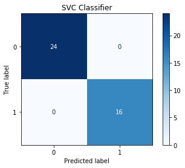
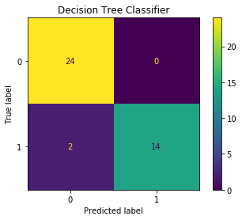
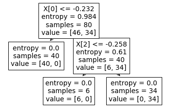
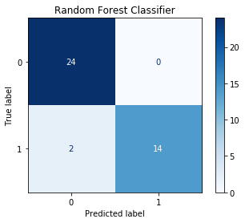
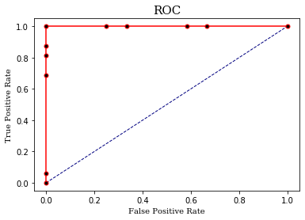

# Predicting Nephritis of Renal Relvis Origin

## Problem Statement

The purpose of this study is; based on the available data, it was estimated whether the person **suffered from renal pelvis origin nephritis** using classification algorithms.

## Dataset

Dataset is downloaded from [archive.ics.uci.edu](https://archive.ics.uci.edu/ml/datasets/Acute+Inflammations) website. Dataset has **8 columns** and **120 rows without the header**.

**Source:**
Jacek Czerniak, Ph.D., Assistant Professor  
Systems Research Institute  
Polish Academy of Sciences  
Laboratory of Intelligent Systems  
ul. Newelska 6, Room 218  
01-447 Warszawa, Poland  
e-mail: jacek.czerniak@ibspan.waw.pl or jczerniak@ukw.edu.pl

## Methodology

In this project, as stated in the title, results were obtained through classifiaction methods such as ***Logistic Regression, K-NN, SVC, Decision Tree*** and ***Random Forest***.  You are free to visit [Machine Learning: Classification Models](https://medium.com/fuzz/machine-learning-classification-models-3040f71e2529) website for learn the methods better.

## Analysis

| # | Column | Non-Null Count | Dtype |
|--|--|--|--|
| 0 | 0 | 120 non-null | object
| 1 | 1 | 120 non-null | object
| 2 | 2 | 120 non-null | object
| 3 | 3 | 120 non-null | object
| 4 | 4 | 120 non-null | object
| 5 | 5 | 120 non-null | object
| 6 | 6 | 120 non-null | object
| 7 | 7 | 120 non-null | object

dtypes: **object(8)**

**Number of NaN:**

> **Number of NaN values:**   0 

### Comparsing Classification Methods

***Logistic Regression Confusion Matrix:***

> **Accuracy score: 1.0**

***K-NN Confusion Matrix:***

> **Accuracy score: 1.0**
> **K-NN Score: 1.0**

***SVC Confusion Matrix:***

> **Accuracy score: 1.0**

***Decision Tree Classifier Confusion Matrix:***

> **Accuracy score: 0.95**

***Random Forest Confusion Matrix:***

> **Accuracy score: 0.95**

---

### AUC

**AUC Score:**
1.0

**False Positive Rate**
 
 [0. 0. 0. 0. 0. 0.
 0.25       0.33333333 0.58333333 0.66666667 1. ]

**True Positive Rate**

 [0. 0.0625 0.6875 0.8125 0.875  1. 1. 1. 1. 1. 1. ]

---

### K-Fold Cross Validation

**Success Mean:**
 1.0
 
**Success Standard Deviation:**
0.0

### Grid Search

**Best result:**
 1.0
 
**Best parameters for Logistic Regression:**
{'C': 1, 'gamma': 1, 'kernel': 'linear'}
 
> **Took 6.556812286376953 seconds to classificate objects.**

## How to Run Code

Before running the code make sure that you have these libraries:

 - pandas 
 - matplotlib
 - seaborn
 - numpy
 - warnings
 - sklearn
 - time
 - pickle
    
## Contact Me

If you have something to say to me please contact me: 

 - Twitter: [Doguilmak](https://twitter.com/Doguilmak) 
 - Mail address: doguilmak@gmail.com
 
